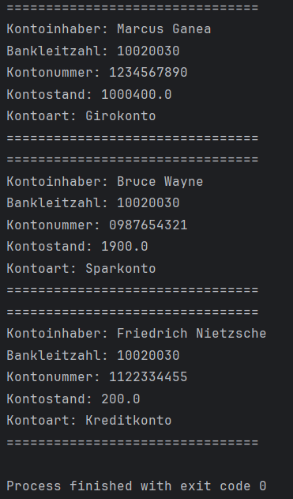

# 2aAPC_A2_Ganea
<a name="readme-top"></a>
# Kontoverwaltung
Author: Ganea Marcus-Alin <br>
LBS Eibiswald | 2aAPC <br>
Erstellt am 13.09.2024

Diese Anwendung ist die zeite Übung vom Labor ITL12...<br>

## Das Ziel der Übung
### Erstelle eine Elternklasse: Kontoklasse und drei Ableitungen: Girokonto, Sparkonto und Kreditkonto

•	Kontoverwaltung 
•	Es ist die Klassenstruktur sowie ein Menü zur Bedienung von zwei Konten zu implementieren.
•	Zwei Konten sind für die letzte Methode überweisen notwendig


## Installation

```cmd

git checkout origin/master
```
## oder
```cmd
git clone https://github.com/MarcusGanea/2aAPC_HelloWorld

```
<p align="right">(<a href="#readme-top">back to top</a>)</p>

## Verwendung
Technologien im Einsatz:
[![Java][java.com]][java-url]

## Code Main.Java
```java
public class Main {
    public static void main(String[] args) {
        // Hardcoded account data
        Girokonto girokonto = new Girokonto("Marcus Ganea", "10020030", "1234567890", 500.0, 10.0, 1000000.0);
        Sparkonto sparkonto = new Sparkonto("Bruce Wayne", "10020030", "0987654321", 2000.0, 5.0);
        Kreditkonto kreditkonto = new Kreditkonto("Friedrich Nietzsche", "10020030", "1122334455", 3000.0, 500.0, 10.0);

        // Perform operations
        girokonto.einzahlen(100.0);
        sparkonto.abheben(100.0);
        kreditkonto.ueberweisen(girokonto, 300.0);

        // Print account statements
        girokonto.kontoauszug();
        sparkonto.kontoauszug();
        kreditkonto.kontoauszug();
    }
}

```
<p align="right">(<a href="#readme-top">back to top</a>)</p>

## Screenshots



<p align="right">(<a href="#readme-top">back to top</a>)</p>


<!-- MARKDOWN LINKS & IMAGES -->
<!-- https://www.markdownguide.org/basic-syntax/#reference-style-links -->
[java.com]: https://img.shields.io/badge/Java-ED8B00?style=for-the-badge&logo=openjdk&logoColor=white
[java-url]: https://www.java.com/de/
[product-screenshot]: Screen.png
